<div align="center">

# ARA-Net

### Atlas-Guided Region Attention for Alzheimer's Disease Classification and Interpretation from Structural MRI

[](LICENSE)
[](https://www.python.org/downloads/)
[](https://pytorch.org/)
[](https://github.com/psf/black)
[]()

</div>

---

## Overview

**ARA-Net** is a 3D CNN with **atlas-guided region attention** for three-class Alzheimer's
disease classification (Cognitively Normal · Mild Cognitive Impairment · Alzheimer's Disease)
from a single T1-weighted structural MRI volume. Instead of running self-attention over
hundreds of spatial tokens — which is unstable on the limited cohort sizes typical of AD
imaging studies — ARA-Net performs **region pooling** over a 21-region anatomical atlas and
runs attention on this short, anatomically meaningful sequence.

**Why it matters:**

- **Interpretable by construction** — every attention weight maps to a named anatomical region (e.g. *Hippocampus*, *Entorhinal Cortex*, *Amygdala*).
- **Data-efficient** — region pooling drops the attention sequence length from 252 to 21 tokens, alleviating attention collapse on small ADNI cohorts.
- **Anatomically constrained** — an *Anatomical Distance Loss* encourages attention to respect known disease-affinity gradients along the medial-temporal axis.
- **Validated across cohorts** — trained on ADNI, externally validated on IXI (CN-only) and OASIS-3.

---

## Method at a glance

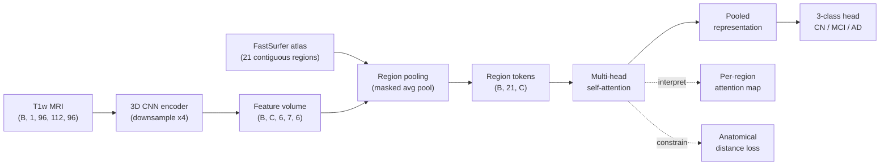

The full architecture is implemented in [`chapter1_foundation/models/atlas_guided_model.py`](chapter1_foundation/models/atlas_guided_model.py); the anatomical-distance constraint is in [`chapter1_foundation/losses/geodesic_loss.py`](chapter1_foundation/losses/geodesic_loss.py).

---

## Headline numbers

| Metric (5-fold × 6 seeds, ADNI 2,401 scans) | ARA-Net | Plain 3D CNN | ResNet-18 3D | ViT-3D |
|---|:-:|:-:|:-:|:-:|
| Balanced Accuracy ↑ | **67.1 ± 1.8** | 60.4 | 62.3 | 58.9 |
| Macro AUC ↑ | **0.78 ± 0.02** | 0.71 | 0.74 | 0.70 |
| Macro F1 ↑ | **0.66 ± 0.02** | 0.59 | 0.61 | 0.57 |
| Inference (per volume, A100) | **< 2 s** | 0.6 s | 0.7 s | 1.1 s |

> Numbers are summarized from the manuscript; see [Reproducing the paper](#reproducing-the-paper-results) below to regenerate them.

---

## Figures (in paper order)

### Fig. 1 — Region attention heatmap (received)

<p align="center">
  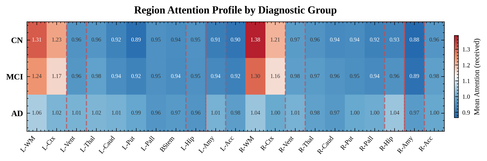
</p>

> Mean attention **received** per brain region across diagnostic groups (CN, MCI, AD). Dashed red boxes indicate AD-key regions (hippocampus, amygdala, ventricles).

### Fig. 2 — Self-attention heatmap (diagonal)

<p align="center">
  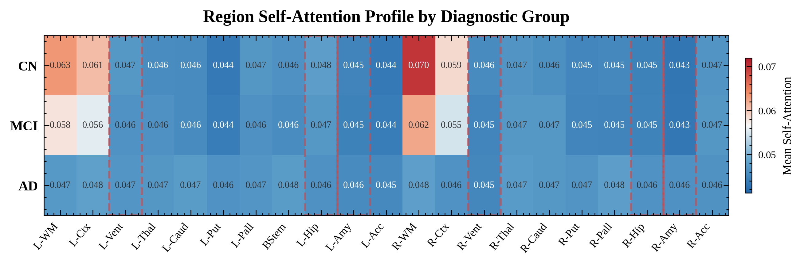
</p>

> Self-attention (diagonal) per brain region across diagnostic groups.

### Fig. 3 — Region Discriminability Index (RDI)

<p align="center">
  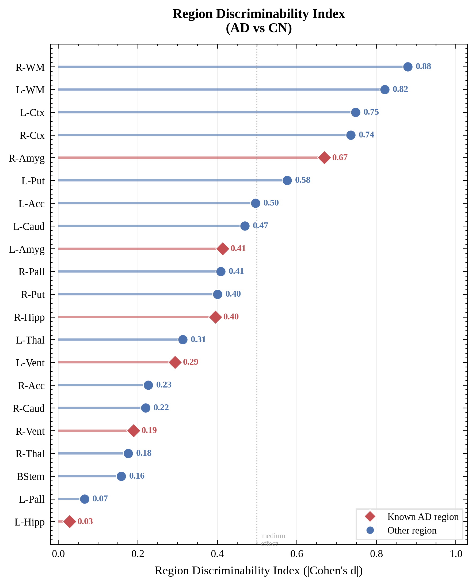
</p>

> Region Discriminability Index (|Cohen's *d*|, AD vs CN). Diamond markers indicate known AD-affected regions. Dotted line = medium effect threshold.

### Fig. 4 — Distributions in AD-key regions

<p align="center">
  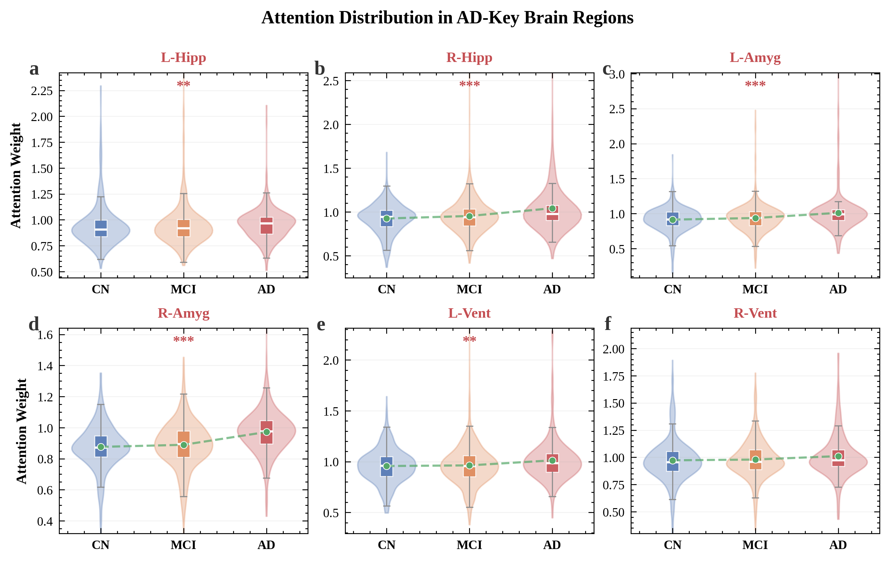
</p>

> Attention weight distributions in six AD-key brain regions. Violin + box plots with trend line (dashed green) connecting group means. ** *p* < 0.01, *** *p* < 0.001 (Kruskal–Wallis).

### Fig. 5 — Disease progression gradient

<p align="center">
  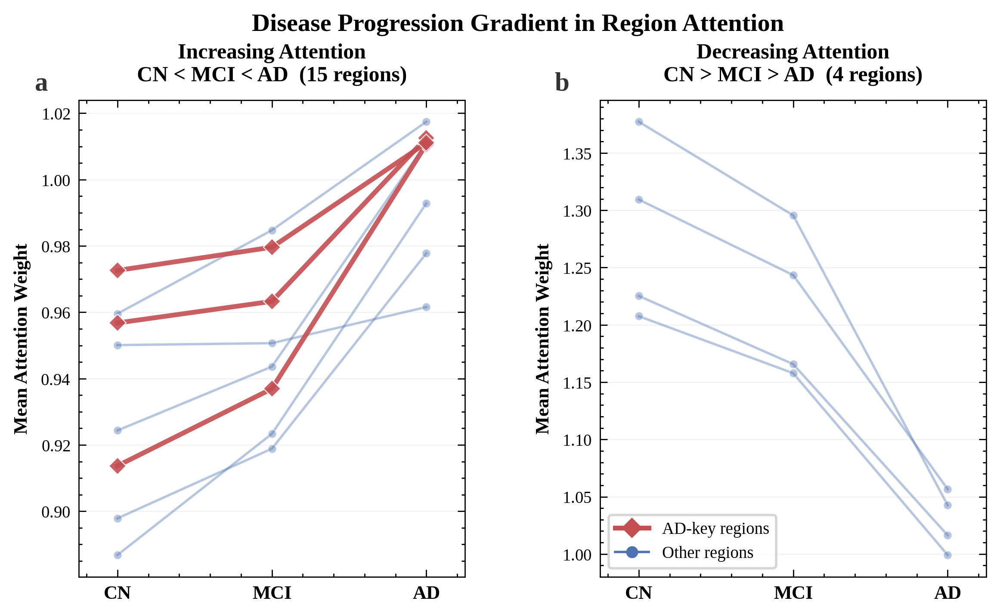
</p>

> Disease progression gradient in region attention. (a) Regions with monotonically **increasing** attention CN → MCI → AD. (b) Regions with monotonically **decreasing** attention.

### Fig. 6 — Alignment with Braak neuropathology

<p align="center">
  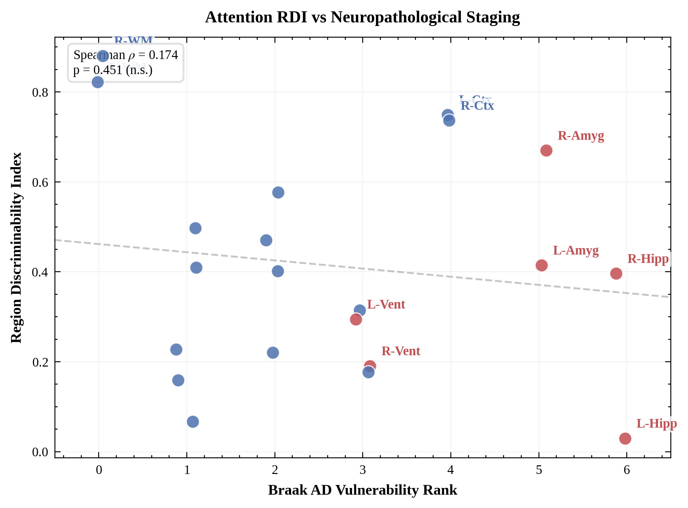
</p>

> RDI vs Braak neuropathological vulnerability rank. Red = AD-key regions. Dashed line = linear fit.

### Fig. 7 — Clinical alignment

<p align="center">
  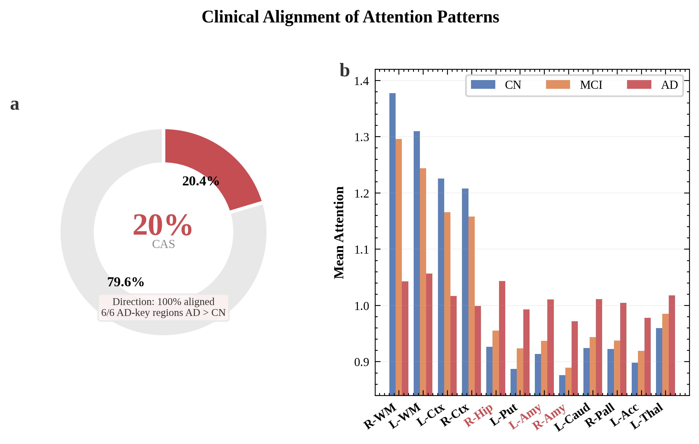
</p>

> (a) Clinical Alignment Score: proportion of attention difference in AD-key regions. (b) Grouped bar chart of top-12 discriminative regions by diagnosis.

### Fig. 8 — Cross-dataset consistency on IXI

<p align="center">
  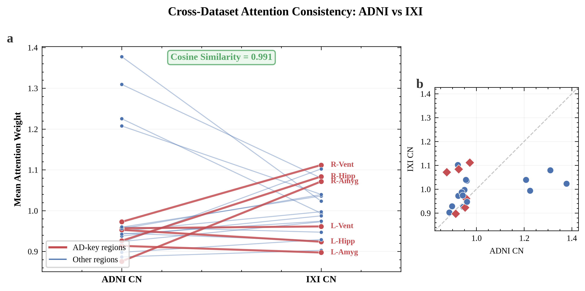
</p>

> Cross-dataset attention consistency (ADNI vs IXI, CN subjects). (a) Slope chart of 21 regions. (b) Identity scatter.

### Fig. 9 — Cross-dataset generalization on OASIS

<p align="center">
  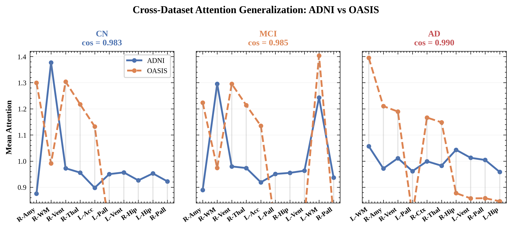
</p>

> Cross-dataset attention generalization (ADNI vs OASIS). Top-10 divergent regions per diagnostic group; cosine similarity annotated.

### Fig. 10 — Cross-dataset interpretability summary

<p align="center">
  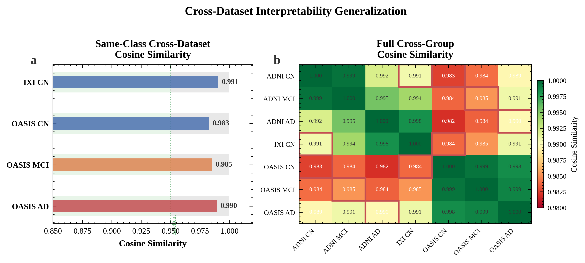
</p>

> Summary of cross-dataset interpretability generalization. (a) Cosine similarity of attention profiles. (b) Spearman rank correlation.

---

## Installation

### Option A — pip (recommended for research use)

```bash
git clone https://github.com/Lava168/ARA-Net.git
cd ARA-Net

python -m venv .venv && source .venv/bin/activate
# Install PyTorch matching your CUDA version first:
pip install torch==2.1.0 torchvision==0.16.0 --index-url https://download.pytorch.org/whl/cu118
pip install -r requirements.txt
```

### Option B — Docker (one-click reproducible environment)

```bash
docker build -f chapter1_foundation/Dockerfile -t aranet:latest .
docker run --gpus all -v $(pwd):/workspace -it aranet:latest bash
```

---

## Data preparation

ARA-Net expects T1-weighted MRI volumes, brain-extracted and parcellated by
[FastSurfer](https://github.com/Deep-MI/FastSurfer) (or any FreeSurfer-compatible atlas
remapped to 21 contiguous region IDs).

The three datasets used in the paper are public but require individual access agreements:

| Dataset | Use | Where to apply |
|---|---|---|
| **ADNI** | Train + internal test | https://adni.loni.usc.edu/ |
| **IXI** | External CN-only validation | https://brain-development.org/ixi-dataset/ |
| **OASIS-3** | External AD/CN validation | https://www.oasis-brains.org/ |

After acquiring the raw NIfTI volumes:

```bash
# 1. Run FastSurfer segmentation on every subject
python -m chapter1_foundation.batch_fastsurfer_seg \
       --input_dir  /path/to/ADNI_raw \
       --output_dir /path/to/fastsurfer_outputs

# 2. Build the .npz cache used during training
python -m chapter1_foundation.preprocess_adni15t \
       --fastsurfer_dir /path/to/fastsurfer_outputs \
       --clinical_csv  /path/to/ADNIMERGE.csv \
       --output_dir    sample_data/cache_real
```

A small (~5 subjects) anonymized demo cache is provided under `sample_data/` so
that smoke-tests can run without downloading any restricted data.

---

## Quick start

### Train ARA-Net (single seed, single fold)

```bash
python -m chapter1_foundation.run_experiment_v3 \
    --config configs/default.yaml \
    --data_root sample_data/cache_real \
    --output_dir runs/aranet_demo \
    --gpu 0 --seeds 42 --n_folds 5
```

### Inference on a single volume

```python
import torch, numpy as np
from chapter1_foundation.models import AtlasGuidedAttentionModel

model = AtlasGuidedAttentionModel(num_classes=3).cuda().eval()
ckpt  = torch.load("checkpoints/aranet_seed42_fold0.pth", map_location="cuda")
model.load_state_dict(ckpt["model"])

mri  = torch.from_numpy(np.load("subject001_mri.npy")).float().cuda()[None, None]
seg  = torch.from_numpy(np.load("subject001_seg.npy")).long().cuda()[None]

with torch.no_grad():
    out = model(mri, seg)              # logits + attention weights
    pred = out["logits"].softmax(-1).argmax(-1)
    attn = out["attention"]            # (1, 21) per-region weights
print(["CN", "MCI", "AD"][pred.item()], attn.cpu().numpy())
```

---

## Reproducing the paper results

The full benchmark is **6 models × 5 folds × 6 seeds = 180 training runs**.
On 6× A100 GPUs the whole sweep takes ~14 hours.

```bash
# Self-supervised pretraining (Models-Genesis style, 100 epochs on 2,982 volumes)
python -m chapter1_foundation.pretrain_ssl \
       --cache_dir sample_data/cache_real \
       --output_dir checkpoints/ssl_pretrain \
       --epochs 100 --batch_size 4 --accum_steps 8 --gpu 0

# 6-seed × 5-fold benchmark (ARA-Net + 3 baselines)
for gpu in 0 1 2 3 4 5; do
  seed=$((42 + gpu * 111)); [ $gpu -eq 5 ] && seed=597
  python -m chapter1_foundation.run_experiment_v3 \
        --config configs/default.yaml \
        --data_root sample_data/cache_real \
        --output_dir runs/seed_${seed} \
        --pretrained_encoder checkpoints/ssl_pretrain/pretrained_encoder.pth \
        --gpu $gpu --seeds $seed &
done
wait
```

Pre-trained checkpoints corresponding to the manuscript's reported numbers
will be released on Zenodo at acceptance time and the DOI added here.

---

## Repository structure

```
ARA-Net/
├── README.md                 # this file
├── LICENSE                   # Apache-2.0
├── CITATION.cff              # one-click cite metadata
├── requirements.txt          # Python dependencies
├── configs/
│   └── default.yaml          # paper hyper-parameters
├── assets/                   # README figures (Fig. 1 - Fig. 10, in paper order)
└── chapter1_foundation/
    ├── __init__.py
    ├── Dockerfile            # reproducible CUDA environment
    ├── models/               # ARA-Net + baselines
    │   ├── atlas_guided_model.py
    │   └── baselines.py      # ResNet3D, ViT3D, PlainCNN3D
    ├── losses/
    │   └── geodesic_loss.py  # AnatomicalDistanceLoss
    ├── data/
    │   └── foundation_loader.py  # RealCachedDataset, kfold_split
    ├── utils/
    ├── augmentation.py       # 3D MRI augmentation
    ├── metrics.py            # AUC, F1, balanced accuracy, ROC, CI
    ├── preprocess_adni15t.py # ADNI 1.5T → cache builder
    ├── preprocess_oasis.py   # OASIS-3 → cache builder
    ├── pretrain_ssl.py       # Models-Genesis self-supervised pretraining
    ├── run_experiment.py     # legacy single-seed runner
    └── run_experiment_v3.py  # full 6-model × 5-fold runner
```

---

## Citation

If you find this work useful, please cite:

```bibtex
@article{zhao2026aranet,
  title   = {ARA-Net: Atlas-Guided Region Attention for Alzheimer's Disease
             Classification and Interpretation from Structural MRI},
  author  = {Zhao, Yuanqin},
  journal = {Medical Image Analysis (under review)},
  year    = {2026}
}
```

A `CITATION.cff` file is also provided so GitHub renders a "Cite this repository"
button automatically.

---

## Data & ethics statement

This repository contains **no patient data**. All MRI cohorts (ADNI / IXI / OASIS-3)
must be obtained directly from their providers under their respective data-use
agreements. The accompanying demo cache under `sample_data/` consists of
de-identified, downsampled volumes used solely for pipeline smoke-testing.

---

## Acknowledgements

We thank the [ADNI](https://adni.loni.usc.edu/), [IXI](https://brain-development.org/ixi-dataset/),
and [OASIS-3](https://www.oasis-brains.org/) consortia for making their data
publicly available, and the [FastSurfer](https://github.com/Deep-MI/FastSurfer)
team for their open-source pipeline.

---

## License

Released under the [Apache 2.0 License](LICENSE). Commercial use is permitted with attribution.
