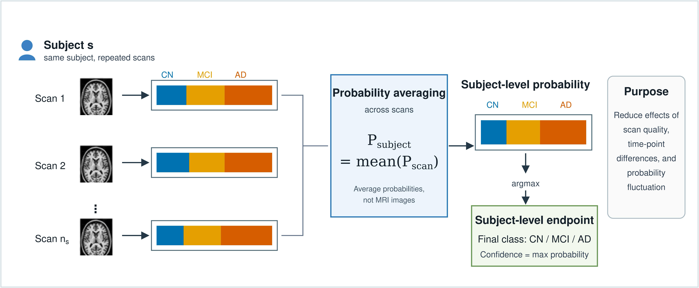
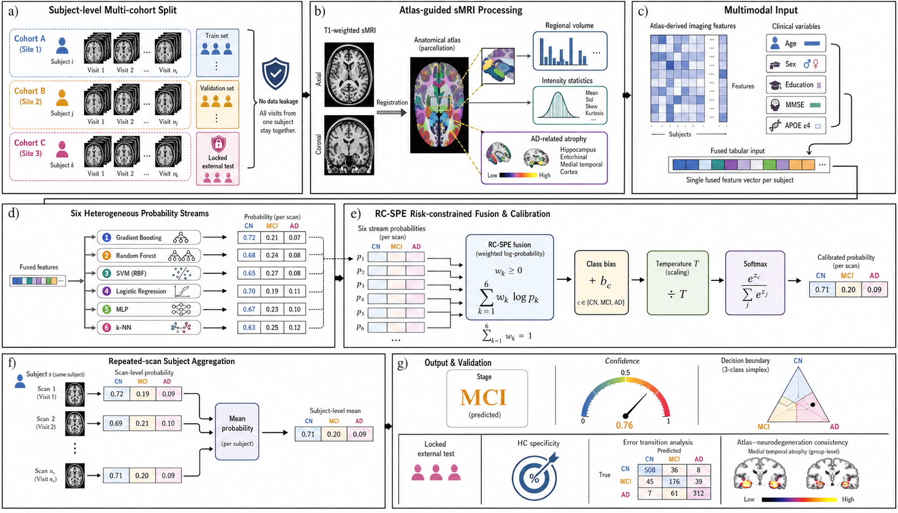

# ARA-Net

**Atlas-Guided Multimodal Alzheimer's Disease Staging with Locked External Subject-Level Validation and Structural Neurodegeneration Consistency**

ARA-Net is a research-grade Alzheimer's disease staging package for CN/MCI/AD classification. The current release centers on **RC-SPE**, a lightweight risk-constrained subject-level probability ensemble, and provides the English manuscript-facing GitHub package: aggregate results, main figures, browser UI prototypes, and claim-boundary documentation.

This repository is an **open-source deployable research prototype**, not a clinical diagnostic device.

## Quick Links

| Entry | Link |
|---|---|
| English manuscript overview | [docs/MANUSCRIPT_OVERVIEW.md](docs/MANUSCRIPT_OVERVIEW.md) |
| V6 analysis workbench | [frontend/v6-final-analysis.html](frontend/v6-final-analysis.html) |
| 3D evidence workbench | [frontend/cvtc-style.html](frontend/cvtc-style.html) |
| Manuscript figure set | [reports/v6_final_model/manual_paper_figures](reports/v6_final_model/manual_paper_figures/README.md) |
| Lightweight runtime metrics | [reports/v6_final_model/tables/lightweight_runtime_metrics.md](reports/v6_final_model/tables/lightweight_runtime_metrics.md) |
| Clinical presentation evidence | [reports/v6_final_model/tables/clinical_presentation_evidence.md](reports/v6_final_model/tables/clinical_presentation_evidence.md) |

## Result Snapshot

| Locked external setting | Unit | Accuracy | Balanced accuracy | Macro AUC | AD-vs-CN AUC / CN retention | CN / MCI / AD recall |
|---|---:|---:|---:|---:|---:|---:|
| AIBL heldout | Subject | 90.3% | 83.3% | 93.7% | AD-vs-CN AUC 100.0% | 96.1% / 68.6% / 85.2% |
| AIBL heldout | Scan | 90.9% | 82.0% | 93.9% | AD-vs-CN AUC 99.8% | 96.4% / 64.2% / 85.4% |
| IXI healthy controls | Subject | 100.0% | 100.0% | NA | CN retention 100.0% | 100.0% / 0.0% / 0.0% |

The main residual errors are concentrated at the MCI/AD boundary. In the locked AIBL subject-level endpoint, AD-to-CN error is 0.000, supporting a boundary-error interpretation rather than disease-to-normal collapse.

## Current V6 Result

The locked main algorithm is **RC-SPE**: a risk-constrained subject-level probability ensemble. It combines six base-model probability streams with log-probability pooling, non-negative model weights, class-specific offsets, temperature scaling, and subject-level probability averaging. It was tuned using ADNI validation, AIBL adaptation validation, and IXI healthy specificity. OASIS was not used for final tuning and is reported only as an external stress-test limitation.

Main locked AIBL heldout subject-level result:

| Metric | Value |
|---|---:|
| Accuracy | 0.903 |
| Balanced accuracy | 0.833 |
| Macro AUC | 0.937 |
| AD-vs-CN AUC | 1.000 |
| Recall CN/MCI/AD | 0.961 / 0.686 / 0.852 |
| IXI healthy CN retention | 1.000 |

Bootstrap 95% confidence intervals for the locked AIBL heldout subject-level result:

| Metric | 95% CI |
|---|---:|
| Balanced accuracy | 0.759-0.899 |
| MCI recall | 0.531-0.839 |
| AD recall | 0.710-0.966 |

Algorithmic evidence for RC-SPE:

| Comparison | AIBL BAcc | MCI recall | AD recall | IXI CN retention |
|---|---:|---:|---:|---:|
| Best single base model | 0.756 | 0.571 | 0.741 | 0.997 |
| Equal log-pooling | 0.648 | 0.171 | 0.778 | 1.000 |
| Full RC-SPE, subject-level | 0.833 | 0.686 | 0.852 | 1.000 |

Leave-one-model-out sensitivity preserved AIBL BAcc 0.823-0.835 and zero AD-to-CN errors after dropping any one base stream, supporting that the locked result is not dependent on a single fragile model.

## Manuscript-Aligned English Package

The current GitHub package is aligned to the manually edited manuscript under the title:

**ARA-Net: Atlas-Guided Multimodal Alzheimer's Disease Staging with Locked External Subject-Level Validation and Structural Neurodegeneration Consistency**

The English public summary is available in [docs/MANUSCRIPT_OVERVIEW.md](docs/MANUSCRIPT_OVERVIEW.md). The release emphasizes four claim-safe contributions:

- Locked AIBL external validation at the subject endpoint.
- RC-SPE lightweight probability-level inference after base-model probabilities are produced.
- Atlas-level structural neurodegeneration consistency focused on AD-relevant regions.
- A GitHub-presentable research UI for probability review and evidence visualization.

## Main Result Figures

The manuscript-aligned figure set is stored in [reports/v6_final_model/manual_paper_figures](reports/v6_final_model/manual_paper_figures/README.md).







Additional manuscript figures:

- [Figure 5. Atlas feature evidence panel](reports/v6_final_model/manual_paper_figures/figure5_atlas_feature_evidence_panel.png)
- [Figure 6. End-to-end workflow](reports/v6_final_model/manual_paper_figures/figure6_end_to_end_workflow.png)
- [Figure 7. RC-SPE probability ensemble UI](reports/v6_final_model/manual_paper_figures/figure7_rcspe_probability_ensemble_ui.png)
- [Supplement. Subgroup and robustness summary](reports/v6_final_model/manual_paper_figures/supplement_subgroup_robustness_summary.png)

## Research UI

The browser research UI is in `frontend/v6-final-analysis.html`. It presents an upload-style analysis workflow, CN/MCI/AD probabilities, subject-level evidence cards, aggregate AIBL/IXI result summaries, and high-resolution PyVista/VTK and Nilearn visual assets.

Run it as a static site from the repository root:

```bash
python3 -m http.server 8000 -d frontend
```

Then open [http://127.0.0.1:8000/v6-final-analysis.html](http://127.0.0.1:8000/v6-final-analysis.html).

The 3D evidence workbench is available at [http://127.0.0.1:8000/cvtc-style.html](http://127.0.0.1:8000/cvtc-style.html) after starting the same static server.

## Repository Contents

- `scripts/rescue_probability_optimizer.py`: probability ensemble, calibration, and subject-level averaging.
- `scripts/final_rescue_model_package.py`: final metrics, bootstrap, and error-analysis package generation.
- `scripts/generate_algorithm_innovation_evidence.py`: RC-SPE ablation, calibration, risk-profile, and leave-one-model-out evidence generation.
- `scripts/generate_v6_final_figures.py`: final v6 manuscript figures.
- `scripts/generate_core_reviewer_evidence_matrix.py`: reproducible evidence matrix for external validation, CAS replacement, and Braak-alternative biological validation.
- `scripts/generate_goal_completion_audit.py`: requirement-level audit tying the V6 rebuild goal to current evidence and explicit limitations.
- `scripts/audit_claim_boundaries.py`: generated audit for unsupported Braak/CAS/OASIS/zero-shot/clinical-deployment overclaims.
- `deployment/research_inference.py`: CLI for research inference from base-model class probabilities.
- `deployment/research_api.py`: HTTP API and static web-console server for research deployment.
- `deployment/final_ensemble_config.json`: locked final ensemble weights, offsets, and temperature.
- `frontend/`: browser-based research console for CSV upload, prediction review, and CSV export.
- `docs/MODEL_CARD.md`: model-card summary, intended use, metrics, and limitations.
- `docs/DATA_CARD.md`: data provenance and public-release boundary.
- `docs/CLINICAL_VALIDATION_PROTOCOL.md`: prospective validation protocol draft.
- `reports/v6_final_model/`: public manuscript-supporting reports, aggregate tables, and figures.
- `reports/v6_algorithm_innovation/`: public aggregate RC-SPE algorithmic evidence, tables, and figures.
- `reports/v6_final_model/core_reviewer_evidence_matrix.md`: generated reviewer-evidence matrix for the three core revision issues.
- `reports/v6_final_model/goal_completion_audit.md`: conservative requirement-level audit showing which parts of the rebuild are supported and which remain bounded limitations.
- `reports/v6_final_model/final_figure_blueprint.md`: planned main and supplementary figure set with panel-by-panel content.
- `reports/v6_final_model/manuscript_v6_full_draft.md`: full V6 manuscript draft for replacing the old Word manuscript body.
- `reports/v6_final_model/ARA-Net_V6_full_manuscript_draft.docx`: generated V6 Word manuscript replacement draft.
- `reports/v6_final_model/final_submission_closure_packet.md`: final manuscript-integration packet for Figure 1, OASIS handling, citations, and terminology.
- `reports/v6_final_model/word_manuscript_rewrite_map.md`: section-by-section rewrite map for converting the old Word manuscript into the V6 submission.
- `reports/v6_final_model/claim_boundary_audit.md`: generated public-file audit for reviewer-safe claim boundaries.
- `reports/v6_final_model/public_release_manifest.md`: generated manifest of public tracked files and restricted-artifact checks.
- `reports/v6_final_model/manual_paper_figures/`: manuscript-aligned main result figures extracted and renamed for the English GitHub release.
- `frontend/v6-final-analysis.html`: research workbench UI for upload-style presentation and evidence visualization.

The public reports intentionally exclude row-level subject/scan prediction files and dataset-derived identifiers.

## Data Availability

Raw ADNI, AIBL, OASIS, and IXI data are governed by their original data-use agreements and are not redistributed in this repository. Users must obtain access from the respective data providers. Public files in this repository are limited to code, aggregate reports, figures, and de-identified/manuscript-level summaries.

## Clinical-Use Boundary

This software is not intended for direct clinical deployment or standalone diagnosis. It is a research-grade, retrospective validation pipeline intended to support further prospective evaluation. Clinical use would require prospective multi-center validation, scanner/protocol robustness testing, local calibration, workflow integration, uncertainty reporting, cybersecurity review, and regulatory assessment.

## Research Deployment

The public deployment wrapper combines already-produced base-model CN/MCI/AD probabilities using the locked final ensemble configuration. It does not process raw MRI files and does not redistribute restricted model artifacts or datasets.

CLI example:

```bash
python deployment/research_inference.py \
  --input-csv examples/probability_input_example.csv \
  --output examples/predictions_subject.csv \
  --unit subject
```

API example:

```bash
python deployment/research_api.py --port 8080
curl http://localhost:8080/health
```

Web console:

```bash
python deployment/research_api.py --host 127.0.0.1 --port 8080
```

Then open [http://localhost:8080](http://localhost:8080). The console accepts the same base-model probability CSV format as the CLI, calls `POST /predict`, summarizes class distribution and confidence, and exports prediction CSV files.

Docker example:

```bash
docker build -t aranet-research .
docker run --rm -p 8080:8080 aranet-research
```

## Reproducing The V6 Reports

After generating prediction CSV files with the training/evaluation scripts, run:

```bash
python scripts/final_rescue_model_package.py \
  --subject-pred-dir outputs/v4/rescue_probability_subject_quick_no_oasis_tune \
  --scan-pred-dir outputs/v4/rescue_probability_no_oasis_tune \
  --subject-summary outputs/v4/rescue_probability_subject_quick_no_oasis_tune/summary.json \
  --scan-summary outputs/v4/rescue_probability_no_oasis_tune/summary.json \
  --feature-csv outputs/v4/atlas_feature_cache_v4.csv \
  --adni-clinical /path/to/adni/master_subjects_v2.csv \
  --aibl-clinical /path/to/aibl/aibl_adnimergelike.csv \
  --out-dir reports/v6_final_model \
  --n-bootstrap 2000
```

Then regenerate figures:

```bash
python scripts/generate_v6_final_figures.py \
  --summary reports/v6_final_model/final_rescue_model_summary_public.json \
  --table2 reports/v4/tables/table2_classification.csv \
  --table-dir reports/v6_final_model/tables \
  --out-dir reports/v6_final_model/figures
```

Generate the core reviewer-evidence matrix:

```bash
python scripts/generate_core_reviewer_evidence_matrix.py
```

Generate the requirement-level goal audit:

```bash
python scripts/generate_goal_completion_audit.py
```

Run the claim-boundary audit:

```bash
python scripts/audit_claim_boundaries.py
```

Generate the public release manifest:

```bash
python scripts/generate_public_release_manifest.py
```

## Python Dependencies

Core analysis dependencies are listed in `requirements.txt`. The lightweight deployment wrapper uses `requirements-deploy.txt`. Some legacy training scripts additionally require PyTorch and scikit-learn. Figure generation requires Matplotlib.

## Documentation

- [Open-source and deployment plan](docs/OPEN_SOURCE_AND_DEPLOYMENT.md)
- [Model card](docs/MODEL_CARD.md)
- [Data card](docs/DATA_CARD.md)
- [Clinical validation protocol draft](docs/CLINICAL_VALIDATION_PROTOCOL.md)
- [Regulatory notes](docs/REGULATORY_NOTES.md)
