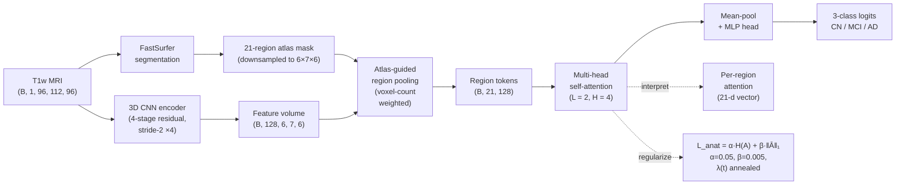
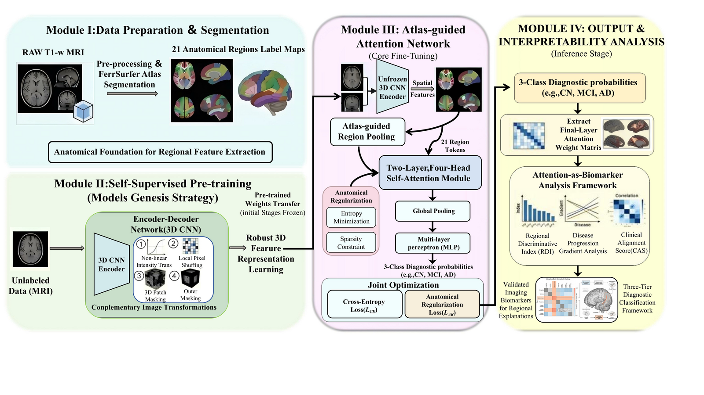
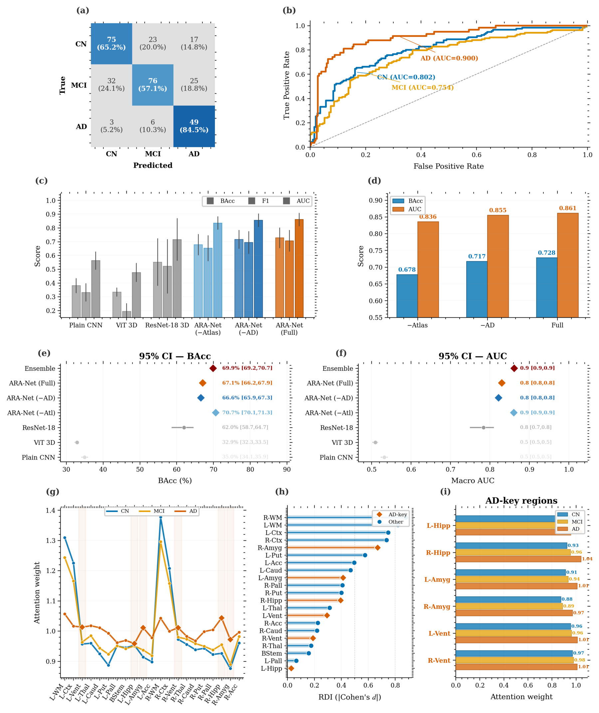
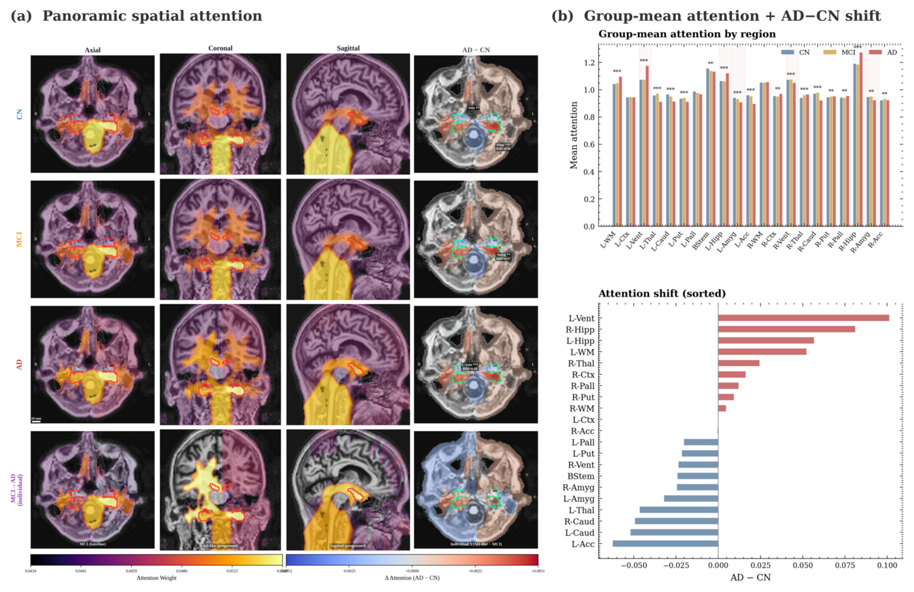
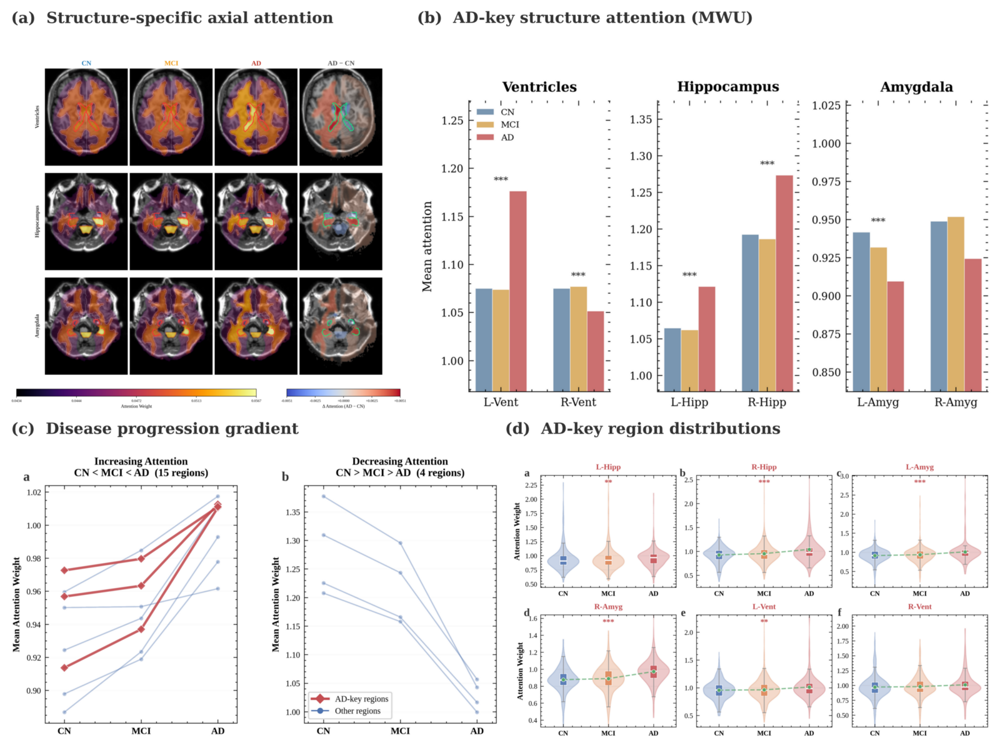
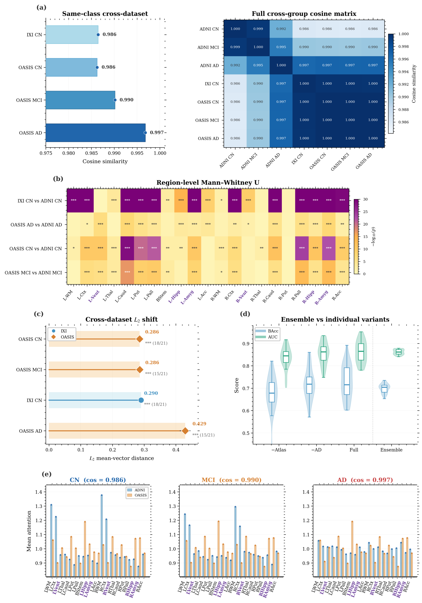
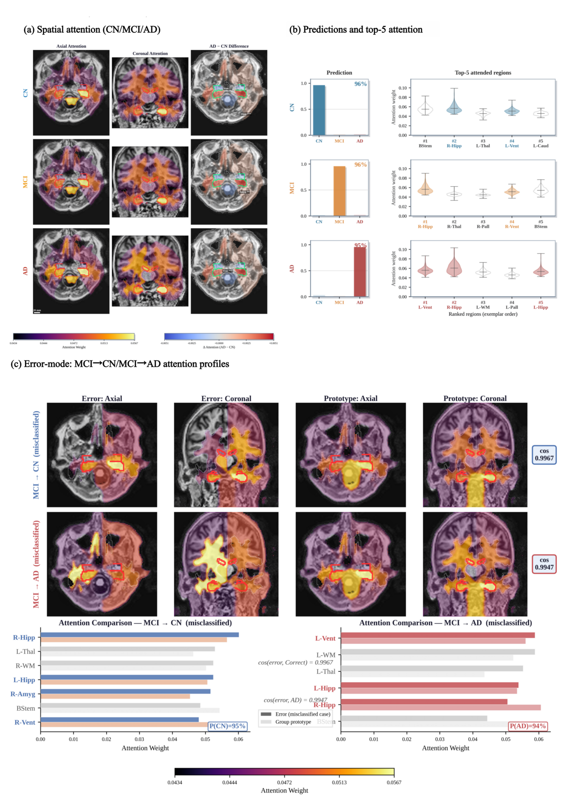
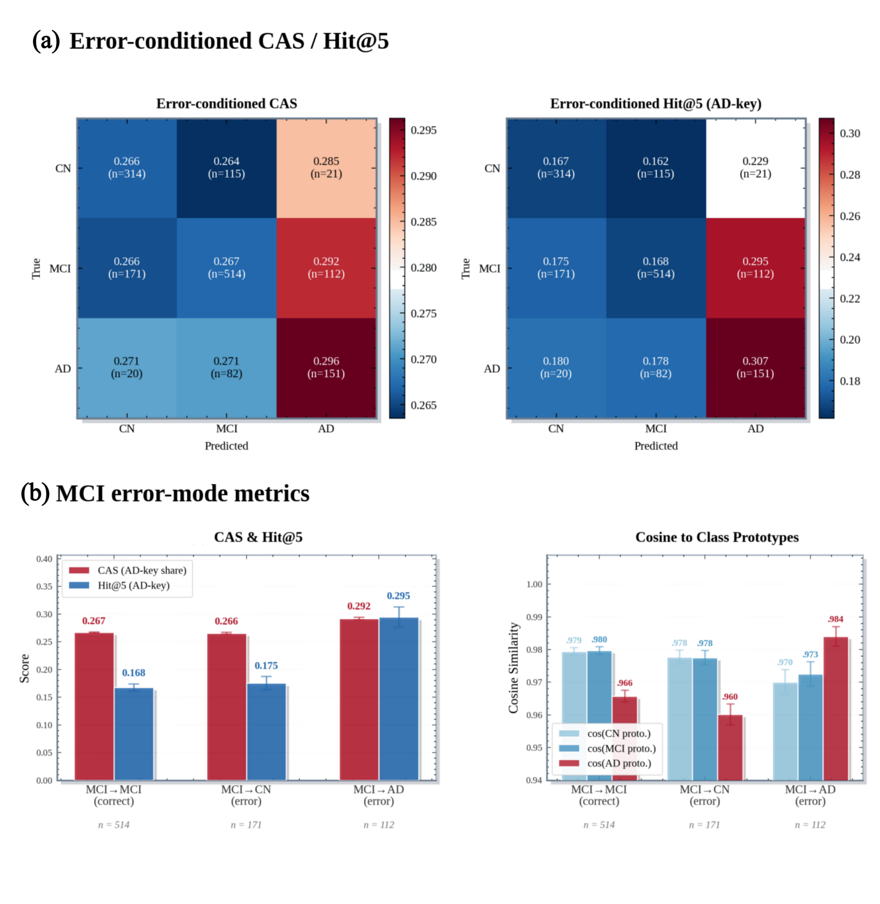

<div align="center">

# ARA-Net

### Atlas-Guided Region Attention for Interpretable Alzheimer's Disease Diagnosis from Structural MRI

[](LICENSE)
[](https://www.python.org/downloads/)
[](https://pytorch.org/)
[](https://github.com/psf/black)
[]()

</div>

---

## Abstract

Deep learning has achieved strong performance for Alzheimer's disease (AD) classification
from structural MRI (sMRI), yet the absence of anatomically grounded interpretability remains
a barrier to clinical adoption. We propose **ARA-Net** (Atlas-guided Region Attention Network),
which integrates **FastSurfer / FreeSurfer parcellation of 21 anatomical regions** with
**multi-head self-attention** and **anatomical regularization** to produce *inherently
interpretable* per-region attention vectors. Trained on **2,401 ADNI** scans
(CN / MCI / AD) and externally evaluated on **IXI** (n = 581) and **OASIS** (n = 99),
ARA-Net reaches **balanced accuracy 67.1 % (95 % CI 66.2–67.9 %)** and **macro-AUC 0.830 ± 0.016**
under a strict 6-seed × 5-fold protocol, and we introduce an **Attention-as-Biomarker**
analysis (RDI, disease-progression gradient, Clinical Alignment Score) showing that the
learned attention recovers established AD neuropathology and remains stable across cohorts
(cosine ≥ 0.986) and under misclassification.

> *This repository accompanies our manuscript currently under review at* **Medical Image Analysis**.

---

## Highlights

- **Inherently interpretable attention.** Atlas-guided region pooling projects voxel-level
  features into 21 anatomically named tokens (bilateral hippocampus, amygdala, ventricles,
  thalamus, caudate, putamen, pallidum, cortex, white matter, …); attention weights are
  therefore directly readable as per-region contributions.
- **Self-supervised + anatomically regularized training.** A 3D-CNN encoder is first
  pre-trained with self-supervision on **887 unlabeled volumes** (306 ADNI training-fold
  subjects + 581 IXI); fine-tuning is regularized with an entropy + L1 loss whose weight
  is annealed to balance anatomical guidance and accuracy.
- **Strict evaluation protocol.** 6 random seeds × 5 stratified folds = **30 independent
  runs** per configuration; metrics reported as mean ± s.d. with bootstrap 95 % CI and
  pairwise Wilcoxon signed-rank tests.
- **Quantitative attention validation.** We introduce three complementary metrics —
  **Region Discriminability Index (RDI)**, **disease-progression gradient**, and
  **Clinical Alignment Score (CAS)** — to test whether attention reflects AD neuropathology.
- **Cross-dataset interpretability.** Same-class attention profiles between ADNI and
  IXI / OASIS reach **cosine similarity > 0.98** without any retraining or domain adaptation.
- **Error-conditioned trust.** Attention remains anatomically coherent even on
  misclassified samples (no "attention collapse"); MCI→CN false negatives keep CAS
  0.266 (vs. 0.267 for correct MCI), and MCI→AD errors shift smoothly along the disease
  continuum.

---

## Method



ARA-Net comprises four modules (Manuscript §2.3 and Fig. 1):

1. **FastSurfer / FreeSurfer segmentation** of the input T1w volume into 21 anatomical
   regions (Manuscript Table 2).
2. **3D CNN encoder** — a 4-stage residual stack on a `96 × 112 × 96` input volume,
   producing a feature volume of shape `(C, 6, 7, 6) = (128, 6, 7, 6)` after four
   stride-2 down-samplings.
3. **Atlas-guided region pooling.** The segmentation is downsampled to the encoder
   feature grid; for each region *k*, features are averaged with a voxel-count weighting
   (denominator = max(|R_k|, 1)) to yield **21 region tokens** with a validity mask that
   prevents attention to anatomically absent regions.
4. **Multi-head self-attention with anatomical regularization.** *L = 2* transformer
   layers with *H = 4* heads (head dim *d_h = 32*) operate on the 21 tokens; mean-pooled
   tokens are passed through an MLP `Linear(128, 128) → GELU → Dropout(0.3) → Linear(128, 3)`.
   The training loss is

   `ℒ_total = ℒ_CE + λ(t) · ℒ_anat`,  with  `ℒ_anat = α · H(A) − β · ‖Ā‖₁`,
   `α = 0.05`, `β = 0.005`, and `λ(t)` annealed across epochs (Manuscript Eqs. 5–7).

The full architecture is implemented in
[`chapter1_foundation/models/atlas_guided_model.py`](chapter1_foundation/models/atlas_guided_model.py);
the regularization terms are in
[`chapter1_foundation/losses/geodesic_loss.py`](chapter1_foundation/losses/geodesic_loss.py).

---

## Datasets

| Dataset | n | Use | Labels | Source |
|---|:-:|---|---|---|
| **ADNI** (1.5 T / 3 T, 60+ sites) | **2,401** | Train + internal CV (5-fold) | CN 750 · MCI 1,156 · AD 495 | https://adni.loni.usc.edu |
| **IXI** (3 UK hospitals)          | **581**   | External validation (CN-only) | CN 581                       | https://brain-development.org/ixi-dataset/ |
| **OASIS**                         | **99**    | External CN/MCI/AD validation | CN 59 · MCI 29 · AD 11       | https://www.oasis-brains.org |

Class imbalance in ADNI (CN : MCI : AD ≈ 3 : 5 : 2) is handled via
**inverse-frequency class weighting** during training. SSL pre-training uses 887 unlabeled
volumes (306 ADNI training-fold subjects + 581 IXI scans); diagnostic labels are not
exposed during pre-training.

---

## Headline results (ADNI three-class CN / MCI / AD, n = 2,401)

All numbers below are mean ± s.d. across **30 independent runs** (6 seeds × 5 folds).
Best per column in **bold**; see Manuscript Table 3.

| Model | BAcc (%) | macro-AUC | wF1 | Rec.CN (%) | Rec.AD (%) | Interp. |
|---|:-:|:-:|:-:|:-:|:-:|:-:|
| Plain CNN              | 35.0 ± 2.6 | —          | 0.213 ± 0.068 | —    | —    | ✗ |
| ViT 3D                 | 32.9 ± 1.7 | —          | 0.198 ± 0.081 | —    | —    | ✗ |
| ResNet-18 3D           | 62.0 ± 8.4 | —          | 0.576 ± 0.104 | —    | —    | ✗ |
| ARA-Net (−Atlas)       | **70.7 ± 1.7** | **0.861 ± 0.013** | **0.675 ± 0.020** | 78.9 | 75.9 | ✗ |
| ARA-Net (−AD reg.)     | 66.6 ± 1.9 | 0.822 ± 0.018 | 0.660 ± 0.024 | —    | —    | ✓ |
| **ARA-Net (Full)**     | 67.1 ± 2.4 | 0.830 ± 0.016 | 0.666 ± 0.025 | 70.2 | 66.8 | **✓** |

**Per-class one-vs-rest AUC (ARA-Net Full):** CN 0.849 · MCI 0.767 · AD 0.870.

**Statistical significance.** Wilcoxon signed-rank on fold-level BAcc:
ARA-Net (Full) vs. ResNet-18 3D Δ = **+5.1 pp**, *p* = 0.001, *r* = 0.60;
vs. ViT 3D Δ = **+34.2 pp**, *p* < 10⁻⁹;
vs. Plain CNN Δ = **+32.1 pp**, *p* < 10⁻⁹.

**Interpretability–accuracy trade-off.** Removing the atlas module entirely gives the
highest accuracy (ARA-Net −Atlas: 70.7 %), confirming that the **3.6 pp BAcc reduction**
is the price ARA-Net pays for inherently anatomical, region-level explanations
(Manuscript §3.3, §4.3).

---

## Attention-as-Biomarker findings

| Quantity | Value | Interpretation |
|---|:-:|---|
| Regions with significant CN/MCI/AD attention difference | **19 / 21** at *p* < 0.05; **16 / 21** at *p* < 0.01 | Group-level sensitivity |
| Top-5 Region Discriminability Index (RDI = \|Cohen's d\|) | R-WM 0.88, L-WM 0.82, L-Ctx 0.75, R-Ctx 0.74, **R-Amyg 0.67** | **Right amygdala emerges in top-5 without any region-level supervision** |
| Monotonic CN→MCI→AD gradients | **15 increasing**, **4 decreasing**; **8** Bonferroni-significant in *both* CN→MCI and MCI→AD | Mirrors centripetal-to-centrifugal AD spread |
| Clinical Alignment Score (CAS) | **0.204** | 6 *a-priori* AD-key regions (bilateral hippocampus / amygdala / ventricles) account for 20.4 % of total attention difference between AD and CN |
| Cross-dataset cosine similarity | IXI CN 0.986 · OASIS CN 0.986 · OASIS MCI 0.990 · OASIS AD **0.997**; full 7 × 7 matrix ≥ 0.986 | Attention template is dataset-, scanner-, and demographics-invariant |
| Error-conditioned CAS | MCI→MCI 0.267 ≈ MCI→CN **0.266**; MCI→AD **0.292** | No "attention collapse"; failure modes shift smoothly along the disease continuum |

---

## Figures (in the order they appear in the manuscript)

> Each figure below is the exact panel published in the manuscript; captions are
> abridged from `Manuscript file.docx`.

### Fig. 1 — Overall framework of ARA-Net

<p align="center">
  
</p>

> **Module I.** FreeSurfer/FastSurfer segmentation of T1w MRI yielding 21-region label maps.
> **Module II.** A 3D-CNN encoder (4-stage residual, stride-2 ×4) maps `(1, 96, 112, 96)` → `(128, 6, 7, 6)`.
> **Module III.** Atlas-guided region pooling produces 21 anatomically grounded region tokens.
> **Module IV.** Multi-head anatomy-guided attention (*L* = 2, *H* = 4) plus an MLP head outputs CN / MCI / AD logits, while attention weights serve as interpretable per-region biomarkers.

### Fig. 2 — Classification performance, attention discriminability, bootstrap 95 % CIs

<p align="center">
  
</p>

> Performance and region-level attention discriminability (n = 2,401; CN/MCI/AD; 30 CV runs).
> **(a)** Confusion matrix (raw counts and row-normalized %).
> **(b)** One-vs-rest ROC curves with per-class AUC.
> **(c)** Ablation and baseline grouped bars (BAcc, macro F1, macro AUC) for Plain CNN, ViT 3D, ResNet-18 3D, and three ARA-Net variants; error bars ±1 s.d.
> **(d)** Accuracy–interpretability trade-off across ARA-Net variants.
> **(e, f)** Bootstrap 95 % CI forest plots for BAcc and macro AUC.
> **(g)** 21-region attention profile by diagnosis; vertical shading marks AD-key regions.
> **(h)** Region Discriminability Index lollipop sorted by |Cohen's *d*|; diamonds = AD-key regions; dashed lines = medium (*d* = 0.5) and large (*d* = 0.8) thresholds.
> **(i)** AD-key region grouped bars (bilateral hippocampus / amygdala / lateral ventricles) for CN, MCI, AD.

### Fig. 3 — Panoramic spatial attention with quantitative regional statistics

<p align="center">
  
</p>

> **(a)** Group-mean attention projected to voxel space and overlaid on a common T1 anatomy across axial / coronal / sagittal planes for CN (row 1), MCI (row 2), and AD (row 3); row 4 = an individual MCI–AD comparison; rightmost column = AD − CN difference (coolwarm); red contours mark AD-key regions; Inferno colormap, γ = 0.55.
> **(b)** Quantitative analysis: grouped bar chart of mean attention per region with Kruskal–Wallis significance, alongside a sorted AD − CN attention shift per region. Scale bar = 20 mm.

### Fig. 4 — Structure-specific attention, disease-progression gradient, AD-key distributions

<p align="center">
  
</p>

> **(a)** Structure-specific axial attention at the ventricular (top), hippocampal (middle) and amygdaloid (bottom) levels; columns = CN, MCI, AD, AD − CN.
> **(b)** AD-key structure grouped bars (Mann–Whitney U) for bilateral ventricles, hippocampi, amygdalae; *** *p* < 0.001.
> **(c)** Disease-progression gradient: 15 monotonically *increasing* (left) and 4 *decreasing* (right) regions from CN to AD; red lines = AD-key regions.
> **(d)** AD-key region violin plots (bilateral hippocampus, amygdala, lateral ventricles) with median/IQR boxes and Kruskal–Wallis significance.

### Fig. 5 — Cross-dataset interpretability generalization

<p align="center">
  
</p>

> ADNI (n = 2,401) vs. IXI (n = 581, CN only) vs. OASIS (n = 99; CN/MCI/AD).
> **(a)** Same-class cosine similarity bars (> 0.98 in all four available comparisons) and the full 7 × 7 cross-group cosine matrix.
> **(b)** Region-level Mann–Whitney U: −log₁₀(*p*) heatmap with significance stars; purple labels = AD-key regions.
> **(c)** Cross-dataset L₂ shift: lollipop with permutation-test significance and Benjamini–Hochberg-corrected region counts.
> **(d)** Ensemble vs. individual variants: violin + box plots of BAcc and AUC.
> **(e)** ADNI vs. OASIS attention profiles per group with cosine similarities annotated.

### Fig. 6 — Individual-level interpretability and error-mode attention

<p align="center">
  
</p>

> **(a)** Group-mean spatial attention (axial, coronal, AD − CN difference) for CN, MCI, AD on a common reference anatomy.
> **(b)** Highest-confidence correctly classified exemplars per group: three-class probabilities and top-5 attended regions ranked by attention weight (with violin summaries of the class-pooled distribution).
> **(c)** Error-mode visualization: MCI→CN (top) and MCI→AD (bottom) misclassification exemplars side by side with class prototypes; cosine similarity annotated.

### Fig. 7 — Error-conditioned interpretability metrics

<p align="center">
  
</p>

> **(a)** 3 × 3 heatmaps of mean **CAS** (left) and **Hit@5** (right) across all true × predicted combinations (CN/MCI/AD); diagonal entries = correct, off-diagonal = misclassification modes.
> **(b)** MCI error-mode metrics: grouped bars of CAS and Hit@5 (left) and cosine similarity to CN / MCI / AD class prototypes (right) for MCI→MCI, MCI→CN, and MCI→AD; error bars ±1 SEM.

---

## Installation

### Option A — pip (recommended for research use)

```bash
git clone https://github.com/Lava168/ARA-Net.git
cd ARA-Net

python -m venv .venv && source .venv/bin/activate
# Install PyTorch matching your CUDA version first:
pip install torch==2.1.0 torchvision==0.16.0 --index-url https://download.pytorch.org/whl/cu118
pip install -r requirements.txt
```

### Option B — Docker (one-click reproducible environment)

```bash
docker build -f chapter1_foundation/Dockerfile -t aranet:latest .
docker run --gpus all -v $(pwd):/workspace -it aranet:latest bash
```

---

## Data preparation

ARA-Net consumes T1w volumes that have been **brain-extracted and parcellated by
[FastSurfer](https://github.com/Deep-MI/FastSurfer)** (a deep-learning replacement for
FreeSurfer) and remapped to **21 contiguous region IDs** following the FreeSurfer
subcortical atlas (bilateral white matter, cortex, lateral ventricles, thalamus, caudate,
putamen, pallidum, hippocampus, amygdala, accumbens, plus brainstem).

```bash
# 1. Run FastSurfer segmentation on every subject (≈ 40 s/volume on A100)
python -m chapter1_foundation.batch_fastsurfer_seg \
       --input_dir  /path/to/ADNI_raw \
       --output_dir /path/to/fastsurfer_outputs

# 2. Build the .npz cache used during training (resamples to 96 × 112 × 96)
python -m chapter1_foundation.preprocess_adni15t \
       --fastsurfer_dir /path/to/fastsurfer_outputs \
       --clinical_csv  /path/to/ADNIMERGE.csv \
       --output_dir    sample_data/cache_real

python -m chapter1_foundation.preprocess_oasis \
       --fastsurfer_dir /path/to/oasis_fastsurfer \
       --output_dir     sample_data/cache_oasis
```

A small (~5-subject) anonymized demo cache is provided under `sample_data/` so smoke
tests run without downloading any restricted data.

---

## Quick start

### Self-supervised pre-training (Models-Genesis style)

```bash
# 887 unlabeled volumes (ADNI training-fold + IXI), 100 epochs
python -m chapter1_foundation.pretrain_ssl \
       --cache_dir   sample_data/cache_real \
       --output_dir  checkpoints/ssl_pretrain \
       --epochs 100 --batch_size 4 --accum_steps 8 --gpu 0
```

### Fine-tune ARA-Net (single seed, single fold)

```bash
python -m chapter1_foundation.run_experiment_v3 \
    --config              configs/default.yaml \
    --data_root           sample_data/cache_real \
    --pretrained_encoder  checkpoints/ssl_pretrain/pretrained_encoder.pth \
    --output_dir          runs/aranet_demo \
    --gpu 0 --seeds 42 --n_folds 5
```

### Inference on a single volume

```python
import torch, numpy as np
from chapter1_foundation.models import AtlasGuidedAttentionModel

model = AtlasGuidedAttentionModel(num_classes=3).cuda().eval()
ckpt  = torch.load("checkpoints/aranet_seed42_fold0.pth", map_location="cuda")
model.load_state_dict(ckpt["model"])

mri  = torch.from_numpy(np.load("subject001_mri.npy")).float().cuda()[None, None]
seg  = torch.from_numpy(np.load("subject001_seg.npy")).long().cuda()[None]

with torch.no_grad():
    out  = model(mri, seg)              # logits + attention weights
    pred = out["logits"].softmax(-1).argmax(-1)
    attn = out["attention"]             # (1, 21) per-region weights
print(["CN", "MCI", "AD"][pred.item()], attn.cpu().numpy())
```

---

## Reproducing the manuscript

The full benchmark is **6 seeds × 5 folds = 30 independent runs** per configuration.
On a single A100, one run (SSL pre-training + three-stage fine-tuning) takes ≈ 24 GPU-h;
the entire CV protocol on 4 × A100 (40 GB) ran ≈ 30 days.

```bash
# 6-seed × 5-fold benchmark (ARA-Net + 3 baselines)
for seed in 42 153 264 375 486 597; do
  python -m chapter1_foundation.run_experiment_v3 \
        --config              configs/default.yaml \
        --data_root           sample_data/cache_real \
        --pretrained_encoder  checkpoints/ssl_pretrain/pretrained_encoder.pth \
        --output_dir          runs/seed_${seed} \
        --seeds ${seed}
done
```

**Optimizer.** AdamW (lr 5 × 10⁻⁴, weight decay 10⁻³, gradient clip ‖g‖₂ ≤ 1.0); 5-epoch
linear warm-up then cosine annealing to 10⁻⁶. **Augmentation.** Random L–R flip with
hemisphere-label swap, random affine (rot ±10°, scale 0.9–1.1), elastic deformation
(α = 8, σ = 4), bias-field, additive Gaussian noise. **Loss schedule.** Anatomical
regularizer weight λ(t) is annealed across epochs (Manuscript Eq. 7) so that early
fine-tuning gets strong region structure and late epochs maximize discrimination.

**Pre-trained checkpoints** corresponding to the manuscript's reported numbers will be
released on Zenodo upon paper acceptance and the DOI added here.

---

## Comparison with state-of-the-art (ADNI three-class)

Methods grouped by evaluation protocol; cross-validation / subject-level splitting in
the upper section (rigorous), single random train-test splits in the lower section
(†; likely inflated due to data-leakage risk). Manuscript Table 6.

| Method | Acc | BAcc | AUC | Interp. | Protocol |
|---|:-:|:-:|:-:|:-:|---|
| Attention-3DCNN  | 65.2 | —    | 0.810 | ✗ | 10-fold CV |
| Hi-Net           | —    | —    | ≈ 0.80 | ✗ | CV |
| 3D DenseNet      | —    | —    | ≈ 0.79 | ✗ | CV |
| Patch-CNN        | —    | —    | ≈ 0.81 | ✗ | CV |
| BrainGNN         | —    | 58.6 | —     | partial (graph) | CV |
| STNet            | 71.8 | —    | —     | ✗ | CV |
| LSTM-Robust      | 76.0 | —    | —     | ✗ | CV |
| ECAResNet        | —    | 74.0 | —     | ✗ | subject-level split |
| **ARA-Net (Full)** | — | **67.1** | **0.830** | **region-level (atlas)** | **6 seeds × 5-fold CV** |
| DEMNET †         | 95.2 | —    | —     | ✗ | single split |
| 3D HCCT †        | 96.1 | —    | —     | ✗ | single split |

ARA-Net achieves the **highest reported macro-AUC** among methods using cross-validation,
and is the **only** method providing by-design region-level interpretability validated
through multiple quantitative metrics (RDI, disease gradient, CAS, cross-dataset
consistency, error-conditioned analysis).

---

## Repository structure

```
ARA-Net/
├── README.md                 # this file
├── LICENSE                   # Apache-2.0
├── CITATION.cff              # one-click cite metadata
├── requirements.txt          # Python dependencies
├── configs/
│   └── default.yaml          # paper hyper-parameters
├── assets/                   # 7 manuscript figures (Fig. 1 – Fig. 7)
└── chapter1_foundation/
    ├── __init__.py
    ├── Dockerfile            # reproducible CUDA environment
    ├── models/
    │   ├── atlas_guided_model.py    # ARA-Net
    │   └── baselines.py             # ResNet-18 3D, ViT 3D, Plain CNN
    ├── losses/
    │   └── geodesic_loss.py         # entropy + L1 anatomical regularizer
    ├── data/
    │   └── foundation_loader.py     # RealCachedDataset, kfold_split
    ├── utils/
    ├── augmentation.py              # 3D MRI augmentation
    ├── metrics.py                   # AUC, F1, BAcc, ROC, bootstrap CI
    ├── preprocess_adni15t.py        # ADNI → cache builder
    ├── preprocess_oasis.py          # OASIS → cache builder
    ├── pretrain_ssl.py              # Models-Genesis SSL pre-training
    ├── run_experiment.py            # legacy single-seed runner
    └── run_experiment_v3.py         # full 6-seed × 5-fold runner
```

---

## Limitations (Manuscript §4.7)

- **Coarse parcellation.** The 21-region FreeSurfer scheme prioritizes clinical
  identifiability; finer atlases (e.g. Desikan-Killiany 68, Schaefer 100–400) would
  improve Braak-stage alignment but reduce per-region voxel counts.
- **No external classification benchmark.** Cross-dataset *interpretability* generalizes
  well, but classification on IXI / OASIS was not formally evaluated and preliminary
  IXI specificity is moderate (43.6 %).
- **Cross-sectional design.** Single-timepoint classification only; longitudinal
  attention trajectories for MCI-to-AD conversion are future work.
- **Single modality.** Structural MRI only — amyloid / tau PET, CSF biomarkers, and
  APOE genotype are not yet fused.
- **No prospective validation.** All results are retrospective on public research cohorts.

---

## Citation

If you find this work useful, please cite:

```bibtex
@article{zhao2026aranet,
  title   = {ARA-Net: Atlas-Guided Region Attention for Interpretable
             Alzheimer's Disease Diagnosis from Structural MRI},
  author  = {Zhao, Yuanqin},
  journal = {Medical Image Analysis (under review)},
  year    = {2026}
}
```

A `CITATION.cff` file is also provided so GitHub renders a *"Cite this repository"*
button automatically.

---

## Data & ethics statement

This repository contains **no patient data**. The ADNI / IXI / OASIS cohorts must be
obtained directly from their providers under their respective data-use agreements; all
three were collected under IRB-approved protocols with written informed consent. The
demo cache under `sample_data/` consists of de-identified, downsampled volumes used
only for pipeline smoke-testing.

---

## Acknowledgements

We thank the [ADNI](https://adni.loni.usc.edu/),
[IXI](https://brain-development.org/ixi-dataset/), and
[OASIS](https://www.oasis-brains.org/) consortia for making their data publicly
available, and the [FastSurfer](https://github.com/Deep-MI/FastSurfer) team for their
open-source pipeline.

---

## License

Released under the [Apache 2.0 License](LICENSE). Commercial use is permitted with
attribution.
