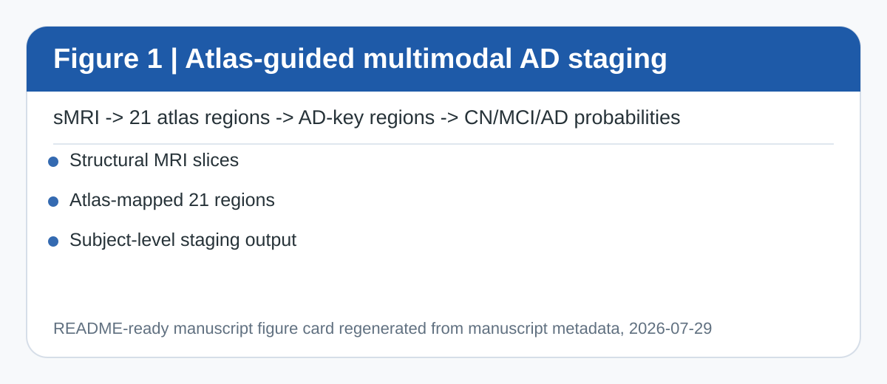
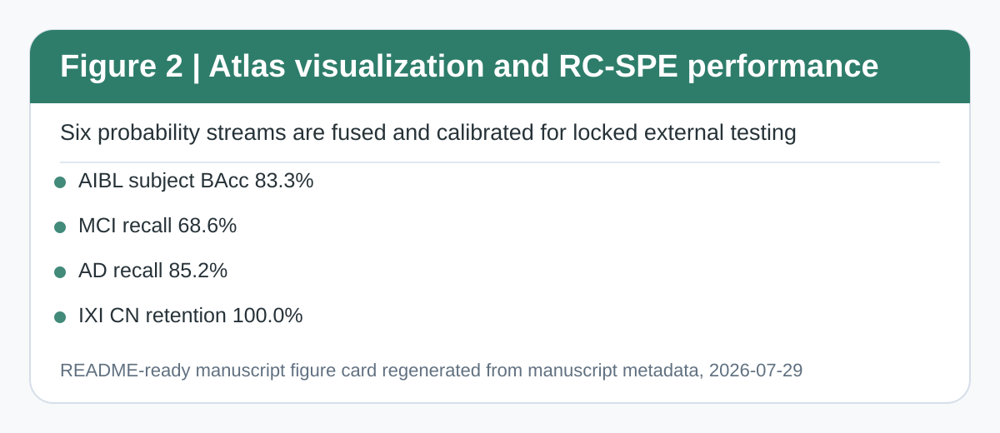
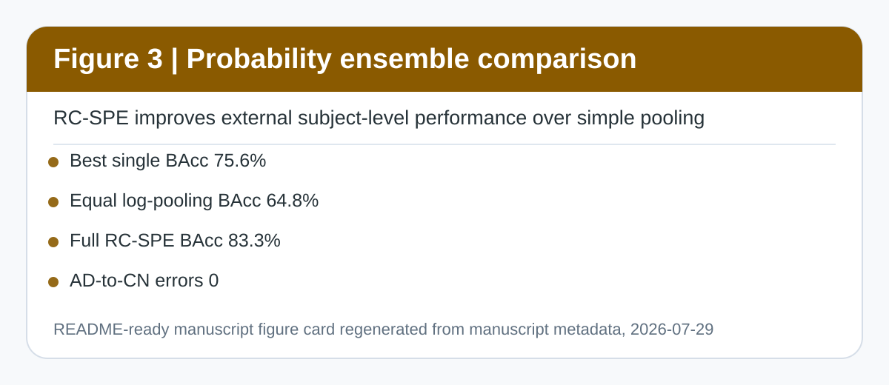
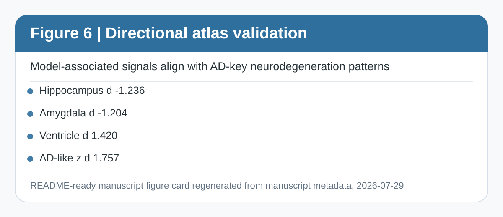
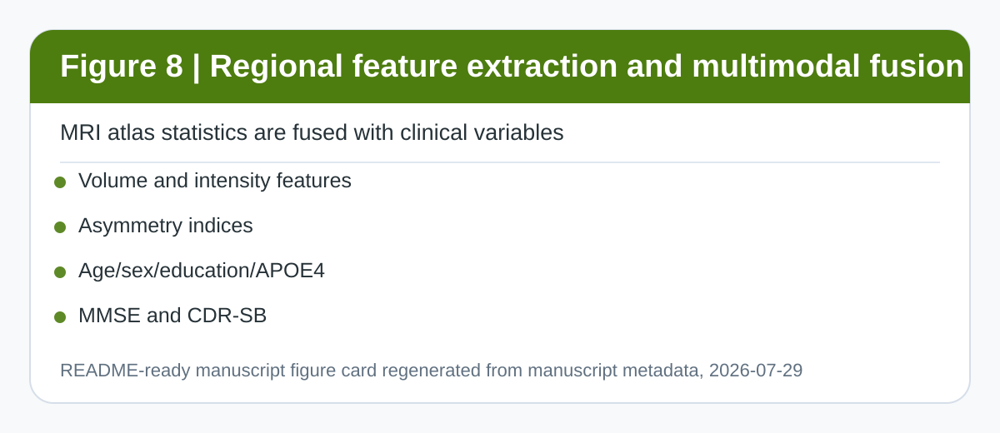
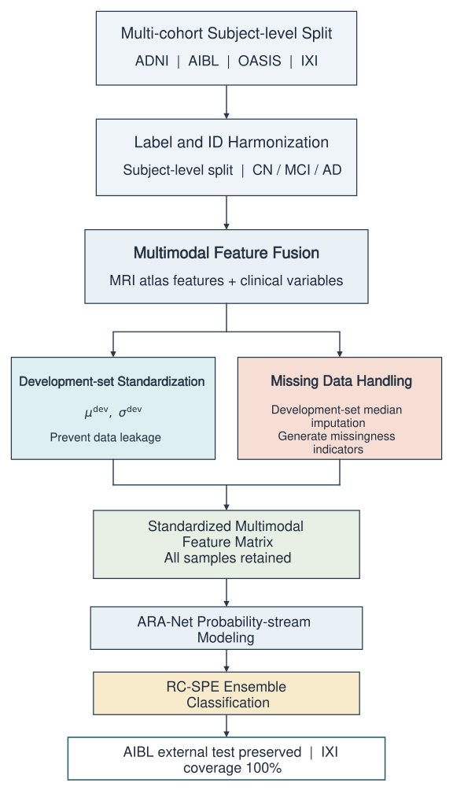
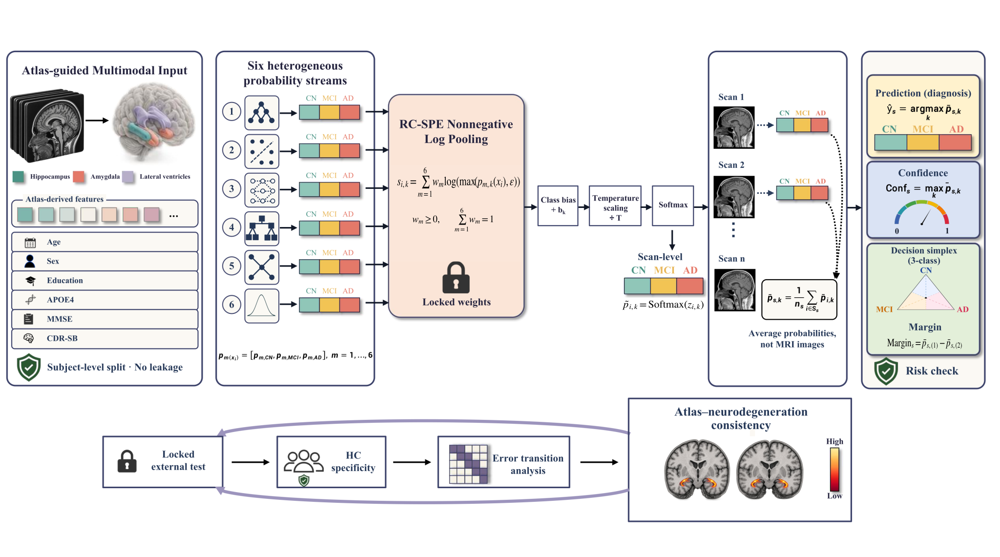

# ARA-Net

**Atlas-Guided Multimodal Alzheimer's Disease Staging with Locked External Subject-Level Validation and Structural Neurodegeneration Consistency**

ARA-Net is a research-grade framework for subject-level Alzheimer’s disease staging across **CN / MCI / AD**. It converts structural MRI into atlas-guided regional features, integrates core clinical variables, and uses **RC-SPE** (Risk-Constrained Subject-level Probability Ensemble) to combine six heterogeneous probability streams into calibrated subject-level predictions.

> This repository is an open-source research prototype. It is not a clinical diagnostic device and is not intended for standalone clinical decision-making.

## What This Repository Contains

- Atlas-guided MRI regional representation for 21 anatomical brain regions.
- Multimodal feature workflow combining MRI atlas features with age, sex, education, APOE4, MMSE, and CDR-SB.
- RC-SPE probability fusion with non-negative weights, class offsets, temperature scaling, and subject-level aggregation.
- Manuscript-aligned figures, tables, model cards, deployment wrappers, and research UI assets.
- Public aggregate evidence only. Restricted MRI volumes, row-level subject tables, and private checkpoints are not redistributed.

## Manuscript Snapshot

| Item | Summary |
|---|---|
| Title | ARA-Net: Atlas-Guided Multimodal Alzheimer's Disease Staging with Locked External Subject-Level Validation and Structural Neurodegeneration Consistency |
| Task | Three-class staging of cognitively normal controls, mild cognitive impairment, and Alzheimer’s disease |
| Input evidence | Structural MRI atlas features plus core clinical variables |
| Main endpoint | Locked AIBL external subject-level validation |
| Final ensemble | RC-SPE, six probability streams, 10 scalar deployment-head parameters |
| Key interpretability check | AD-key structural consistency in hippocampus, amygdala, and lateral ventricles |
| Clinical boundary | Research use only; prospective validation and regulatory review are required before clinical deployment |

## Main Results

| Locked external setting | Unit | Accuracy | Balanced accuracy | Macro AUC | AD-vs-CN AUC / CN retention | CN / MCI / AD recall |
|---|---:|---:|---:|---:|---:|---:|
| AIBL locked external test | Subject | 90.3% | 83.3% | 93.7% | AD-vs-CN AUC 100.0% | 96.1% / 68.6% / 85.2% |
| AIBL locked external test | Scan | 90.9% | 82.0% | 93.9% | AD-vs-CN AUC 99.8% | 96.4% / 64.2% / 85.4% |
| IXI healthy control | Subject | 100.0% | 100.0% | NA | CN retention 100.0% | 100.0% / 0.0% / 0.0% |

On the locked AIBL subject-level endpoint, RC-SPE reached **0.903 accuracy**, **0.833 balanced accuracy**, **0.937 macro AUC**, and **1.000 AD-vs-CN AUC**. The residual errors were concentrated mainly at the MCI/AD staging boundary, with **zero AD-to-CN errors** in the locked subject-level endpoint.

## RC-SPE In One Paragraph

RC-SPE is not a simple average ensemble. For each scan, six base probability streams produce CN/MCI/AD probabilities. RC-SPE fuses them with non-negative weighted log-probability pooling, adds class-specific offsets, applies temperature scaling, and then averages scan-level probabilities for subjects with repeated scans. The final prediction is made at the subject level, matching the primary external validation endpoint.

| RC-SPE component | Manuscript setting |
|---|---:|
| Number of classes | 3: CN, MCI, AD |
| Number of base streams | 6 |
| Weight constraint | `w_m >= 0`, `sum(w_m) = 1` |
| Temperature | 0.672 |
| Class offsets | CN -0.796, MCI -0.190, AD 0.986 |
| Output parameters | 10 scalar parameters |
| JSON configuration size | 1,663 bytes |
| Mean runtime | 0.026 ms per scan row; 0.035 ms per subject endpoint |
| Throughput | 38,347 scan rows/s; 28,760 subject units/s |

## Ablation And Calibration

| Method | Acc | BAcc | ECE | NLL | Brier score | IXI CN retention |
|---|---:|---:|---:|---:|---:|---:|
| Best Single Base Model | 0.866 | 0.756 | 0.122 | 0.416 | 0.211 | 0.997 |
| Arithmetic Mean Ensemble | 0.866 | 0.711 | 0.112 | 0.400 | 0.205 | 1.000 |
| Equal Log-pooling | 0.833 | 0.648 | 0.094 | 0.400 | 0.216 | 1.000 |
| Final Weights Only | 0.903 | 0.815 | 0.136 | 0.366 | 0.179 | 1.000 |
| Weights + Offsets | 0.898 | 0.823 | 0.219 | 0.475 | 0.235 | 1.000 |
| Weights + Temperature | 0.903 | 0.815 | 0.052 | 0.298 | 0.152 | 1.000 |
| Full RC-SPE | 0.903 | 0.833 | 0.078 | 0.320 | 0.160 | 1.000 |

The complete RC-SPE improved AIBL balanced accuracy from **0.756** for the best individual base model to **0.833**, while preserving IXI CN retention at **1.000**.

## Structural Neurodegeneration Consistency

ARA-Net validates model-associated structural evidence against prespecified AD-key regions: bilateral hippocampi, bilateral amygdalae, and bilateral lateral ventricles. On the locked AIBL external test set, the AD-key enrichment score was **0.510**, exceeding the uniform-null expectation of **0.286** (`p = 0.026`; bootstrap 95% CI: 0.479-0.526). Directional analyses showed lower hippocampal and amygdalar volume and higher lateral-ventricular volume in AD, consistent with known AD-related neurodegeneration.

| Cohort | AD/CN endpoints | Direction match | Hippocampus d | Amygdala d | Ventricle d | AD-like z d | Fisher p |
|---|---:|---:|---:|---:|---:|---:|---:|
| ADNI validation | 20/30 | 4/4 | -2.228 | -1.466 | 1.176 | 2.275 | 1.40e-19 |
| ADNI internal test | 20/29 | 4/4 | -1.337 | -0.979 | 0.847 | 1.288 | 4.84e-13 |
| AIBL adaptation validation | 14/75 | 4/4 | -1.686 | -2.257 | 1.205 | 2.361 | 4.01e-21 |
| AIBL locked heldout | 27/154 | 4/4 | -1.236 | -1.204 | 1.420 | 1.757 | 1.40e-29 |
| OASIS stress | 11/59 | 2/4 | 0.038 | 0.026 | 0.480 | 0.487 | 0.055 |

OASIS is treated as a stress-test boundary rather than a tuning cohort. Its distribution shift produced a strong CN bias and should not be interpreted as successful zero-shot generalization.

## Manuscript Figures

The README figure set below was regenerated from the final manuscript figure directory on 2026-07-29.

### Figure 1. Atlas-guided multimodal AD staging



### Figure 2. Atlas visualization and RC-SPE performance overview



### Figure 3. Probability ensemble strategy comparison



### Figure 4. Subject-level probability aggregation


### Figure 5. Error-structure analysis and atlas evidence


### Figure 6. Directional validation of brain atlas structures



### Figure 7. Complete ARA-Net workflow


### Figure 8. Atlas-guided regional feature extraction and multimodal fusion



### Figure 9. Multi-cohort standardization and missing-variable workflow



### Figure 10. RC-SPE workflow



## Repository Map

```text
configs/                  Dataset-specific protocol YAML files
src/data/                 Probability-stream CSV validation helpers
src/atlas/                FreeSurfer/FastSurfer AD-key label definitions
src/models/               Public base-model stream metadata
src/fusion/               RC-SPE log-probability fusion
src/calibration/          Temperature and class-offset calibration helpers
src/constraints/          Specificity and severe-error guardrails
src/aggregation/          Subject-level probability averaging
src/evaluation/           Metrics and public evaluation workflow
src/interpretation/       Aggregate atlas-evidence summaries
deployment/               Research inference CLI, API wrapper, and Docker entrypoint
frontend/                 Browser-based research UI prototypes
docs/                     Manuscript overview, model card, data card, validation notes
reports/                  Aggregate manuscript-supporting reports and prior figure assets
assets/manuscript_figures/ README-ready figures regenerated from the final manuscript folder
```

The public code operates on base-model probability streams and aggregate atlas features. It does not redistribute restricted MRI scans, dataset-derived subject tables, or private model checkpoints.

## Quick Start: Probability-Level Research Inference

The public deployment wrapper combines already-produced base-model CN/MCI/AD probability streams with the locked RC-SPE configuration. It does not process raw MRI files.

```bash
python deployment/research_inference.py \
  --input-csv examples/probability_input_example.csv \
  --output examples/predictions_subject.csv \
  --unit subject
```

API wrapper:

```bash
python deployment/research_api.py --host 127.0.0.1 --port 8080
curl http://127.0.0.1:8080/health
```

Docker:

```bash
docker build -t aranet-research .
docker run --rm -p 8080:8080 aranet-research
```

## Data Availability

Raw ADNI, AIBL, OASIS, and IXI data are governed by their original data-use agreements and are not redistributed in this repository. Users must obtain access from the respective data providers. Public repository files are limited to code, aggregate reports, generated figures, de-identified examples, and manuscript-level summaries.

## Intended Use And Limitations

ARA-Net is intended for retrospective research, reproducibility review, and method development. Any clinical use would require prospective multi-center validation, scanner/protocol robustness testing, local calibration, uncertainty reporting, workflow integration, cybersecurity review, and regulatory assessment.

Key limitations:

- The public repository does not include restricted raw MRI data or private training checkpoints.
- The deployment wrapper assumes upstream MRI processing and base probability generation have already been completed.
- MCI remains the major uncertainty source in locked external validation.
- OASIS stress testing indicates a domain-shift boundary and should not be described as successful generalization.

## Citation

A formal citation will be added after manuscript publication or preprint release. For now, cite the repository as:

```text
Zhao Y, Mao J, Hu J, Wang X, Zhang X, Zhou B, Song Z, Guo T, Ma S. ARA-Net: Atlas-Guided Multimodal Alzheimer's Disease Staging with Locked External Subject-Level Validation and Structural Neurodegeneration Consistency. GitHub repository, 2026.
```
