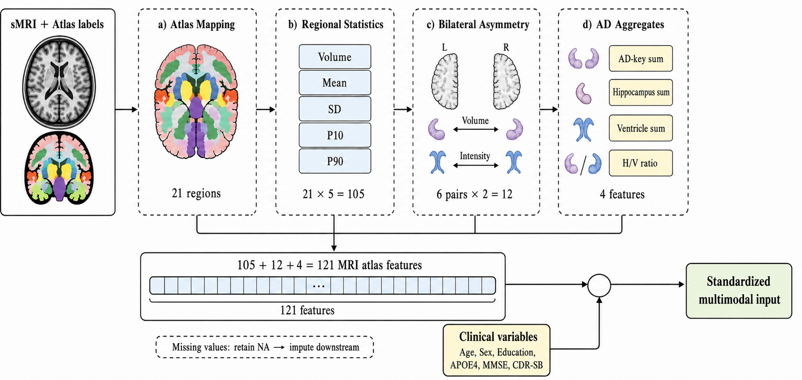
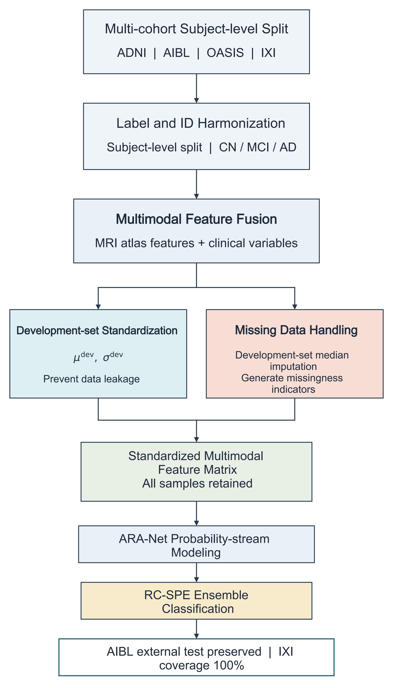
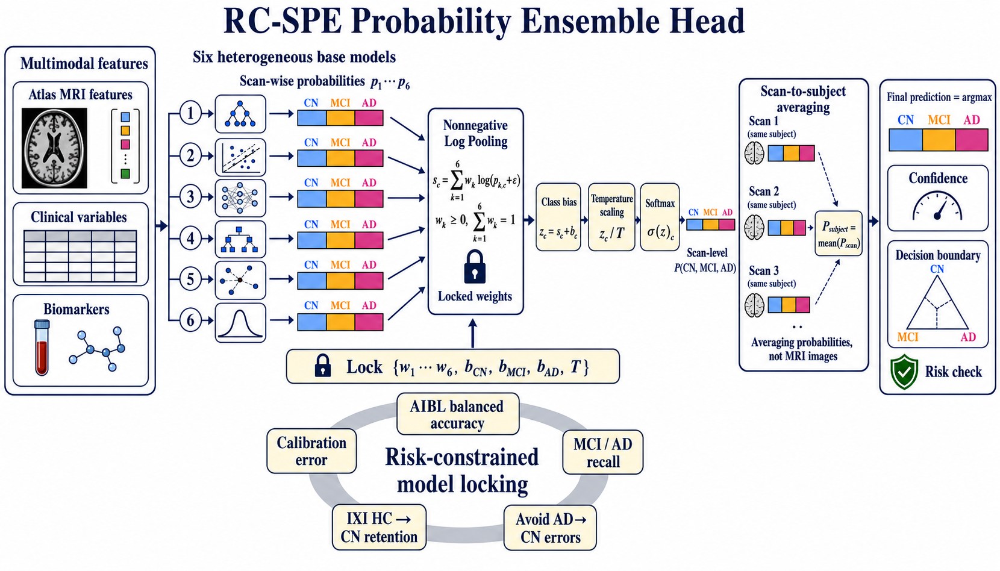
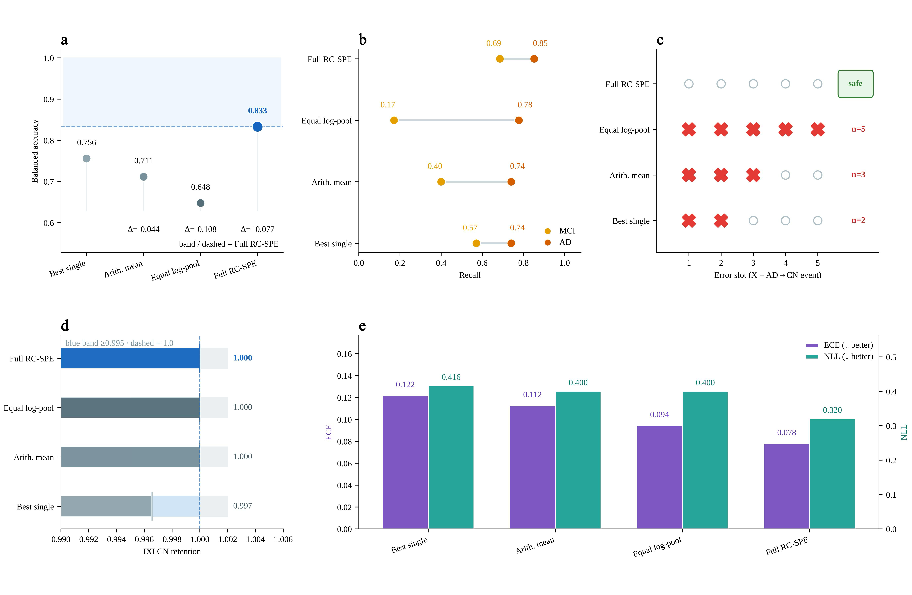

# Manual Manuscript Figure Set

These images were extracted from the manually edited ARA-Net manuscript package and renamed for the English GitHub release. They are intended as manuscript-level public figures and presentation assets.

## Main Figures

### Figure 1. Atlas-Guided Staging Overview

High-level atlas-guided multimodal staging overview for CN, MCI, and AD classification.

### Figure 2. Locked External Performance

Locked external performance summary emphasizing AIBL subject-level and scan-level results.

### Figure 3. Subject-Level Error Structure

Representative subject-level error structure and atlas evidence, including boundary errors between MCI and AD.

### Figure 4. Research Workbench UI

Research workbench presentation view for upload-style analysis, probability review, and evidence display.

### Figure 5. Atlas Feature Evidence Panel

Atlas feature and structural evidence panel supporting neuroanatomical plausibility claims.

### Figure 6. End-To-End Workflow

End-to-end workflow figure connecting MRI preprocessing, atlas features, probability streams, RC-SPE aggregation, and evidence review.

### Figure 7. RC-SPE Probability Ensemble UI

Probability ensemble presentation for RC-SPE, including confidence and subject-level review components.

## Supplementary Result Figure

### Supplement. Subgroup And Robustness Summary

Supplementary subgroup and robustness-style summary retained as supporting visual evidence.
